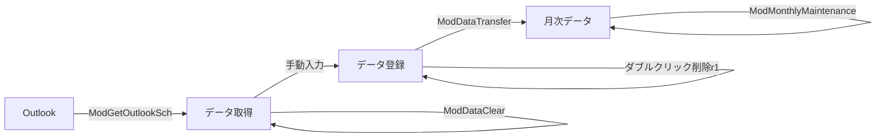

# LS入力システム 詳細設計書

最終更新: 2025-08-30 / 作成: JJ-07

## 1. システム構成
### 1.1 モジュール一覧
| モジュール | 主なプロシージャ | 役割 |
| --- | --- | --- |
| ModAppConfig | GetSheetName, GetSheet | シート名や列の定数管理 |
| ModCommonUtils | SaveAndSetApplicationState, RestoreApplicationState, DetermineTargetDate, ReportErrorToMonthlySheet | 共通処理 |
| ModGetOutlookSch | GetOutlookSchedule | Outlookから予定取得 |
| ModDataClear | ClearInputData | 入力欄クリア |
| ModDataTransfer | TransferDataToMonthlySheet | 日次データ転記 |
| ModMonthlyMaintenance | ClearMonthlyDataAndRefreshCalendar | 月次データ全クリアとカレンダー再生成 |
| ダブルクリック削除r1 | Worksheet_BeforeDoubleClick | 行単位クリアイベント |

### 1.2 データフロー

## 2. モジュール詳細
### 2.1 ModAppConfig
- 概要: シート名や列番号、Enumを定義し、共通の定数を提供する。
- 主な定数: `ERR_CELL_ADDR`、`DATA_ENTRY_DATE_CELL`
- 主な列Enum:
  - `DataSheetColumn`: 作番・区分・時間列などを指定。
  - `MonthlySheetColumn`: 月次シートの列位置。
- 補助関数: `GetSheetName`, `GetSheet`

### 2.2 ModCommonUtils
- 概要: アプリケーション状態の保存／復元、シート保護解除、対象日判定、エラー表示など共通処理をまとめる。
- 構造体: `ApplicationState`, `SheetProtectionInfo`
- 主なプロシージャ:
  - `SaveAndSetApplicationState(prevState)`
  - `RestoreApplicationState(prevState)`
  - `UnprotectSheetIfNeeded(ws, protInfo)`
  - `RestoreSheetProtection(ws, protInfo)`
  - `DetermineTargetDate(wsData, targetDate)`
  - `ReportErrorToMonthlySheet(message, append)`

### 2.3 ModGetOutlookSch
- 目的: Outlookから指定日付の予定を取得し、「データ取得」シートに出力する。
- 主な処理の流れ:
  1. 対象日を `C3` から取得し検証。
  2. 出力範囲を初期化しヘッダーを設定。
  3. 名前定義からキーワード行列を読み込み、件名を分類・区分に判定。
  4. Outlookへ接続し予定を抽出。
  5. 時刻順にシートへ書き込み、必要に応じて `D4` に日付コピー。
- 代表関数: `GetOutlookSchedule`

### 2.4 ModDataClear
- 目的: 「データ取得」「データ登録」両シートの入力欄を一括でクリアする。
- 主なプロシージャ: `ClearInputData`
- 処理概要:
  1. ユーザーに確認ダイアログを表示。
  2. 両シートの保護状態を確認し必要に応じて解除。
  3. 定数で定義された範囲の値をクリア。
  4. 終了時にシート保護とアプリ状態を復元。

### 2.5 ModDataTransfer
- 目的: 「データ登録」シートの実績を集計し「月次データ」に転記する。
- 主なプロシージャ: `TransferDataToMonthlySheet`
- 処理概要:
  1. アプリ状態を退避しエラーセルをクリア。
  2. 対象日やシートを初期化 (`InitializeTransferConfig`)。
  3. 入力行を走査し `作業コード|作番` キーで分単位に集計。
  4. 必要に応じて列を追加し、対象セルへ時間を書き込む。
  5. 重複があればセルをハイライトしエラーセルへ記録。
  6. 結果サマリーをダイアログ表示し、必要情報をクリップボードへコピー。

### 2.6 ModMonthlyMaintenance
- 目的: 月次データの転記領域を全クリアし、B列の日付カレンダーを対象月で再生成する。
- 主なプロシージャ: `ClearMonthlyDataAndRefreshCalendar`
- 処理概要:
  1. 対象月を「データ登録」シートから取得。
  2. 対象月の最終日行までの値と塗りつぶしをクリア。
  3. ユーザー確認後、B列に1日〜末日をセット。
  4. シート保護状態を復元し、エラーがあれば `I1` に追記。

### 2.7 ダブルクリック削除r1
- 目的: 指定シートのB列セルをダブルクリックすると、同じ行のC〜F列とH列をクリアする。
- 主なイベント: `Worksheet_BeforeDoubleClick`
- 処理概要:
  1. B列以外や対象外行の場合は即終了。
  2. 既定の編集モードをキャンセルし、クリア対象範囲を設定。
  3. 必要に応じてシート保護を解除し、セル内容をクリア。
  4. 最後にイベントとシート保護を復元。

## 3. エラー処理共通方針
- 重要なエラーは `MsgBox` で通知し、`I1` または `J3` に追記。
- アプリ状態とシート保護は処理終了時に必ず復元する。

## 4. 変更履歴
- 2025-08-30: 初版作成
