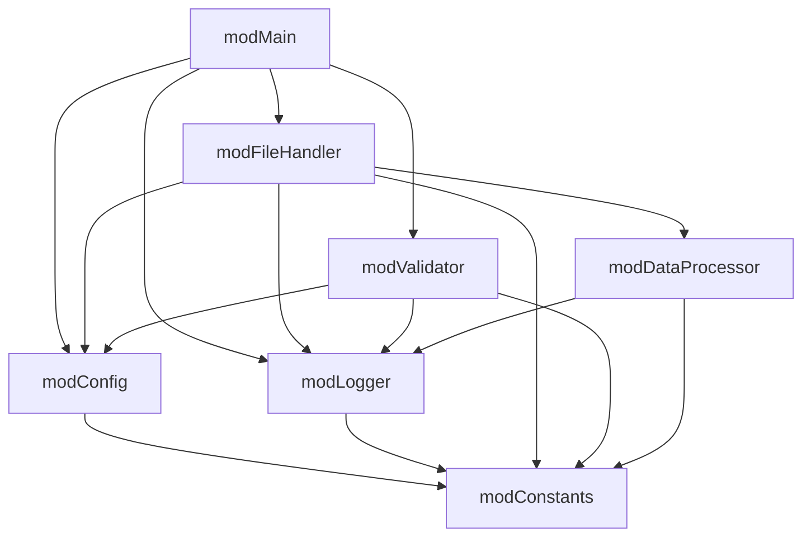
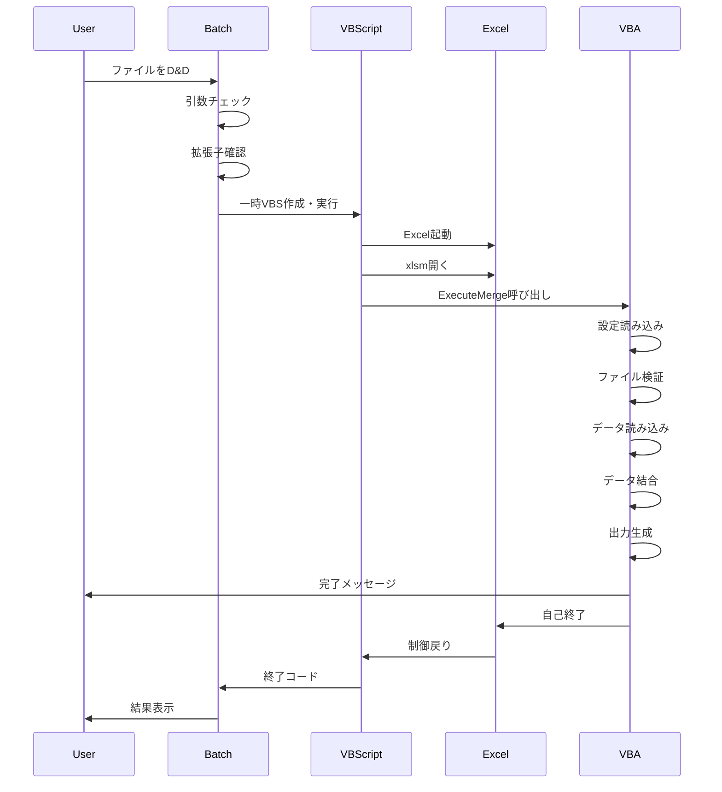

# Excel結合処理システム 詳細設計書

**文書情報**

- 作成日：2026年1月7日
- バージョン：2.0
- 文書種別：詳細設計書
- 実装方式：Excelマクロ（VBA）+ バッチファイル

---

## 1. システム概要

### 1.1 目的

2つのExcelファイルを識別コード（キー列）で照合し、横方向に結合した新しいExcelファイルを出力するシステム。

### 1.2 システム構成図

```
┌────────────────────────────────────────────────────────────────┐
│              Excel結合処理システム v2.0                          │
├────────────────────────────────────────────────────────────────┤
│  ┌──────────────┐                                              │
│  │ Start.bat    │  ①ドラッグ&ドロップ                           │
│  │ (起動バッチ)  │←─────────── Excel1 + Excel2               │
│  └──────┬───────┘                                              │
│         │②VBScript経由で起動                                    │
│         ↓                                                       │
│  ┌──────────────┐     ③設定読込    ┌─────────────┐            │
│  │ExcelMerge    │←───────────────→│MergeConfig  │            │
│  │Engine.xlsm   │                  │.xlsx        │            │
│  │(処理エンジン) │                  └─────────────┘            │
│  └──────┬───────┘                                              │
│         │④VBAマクロ実行                                         │
│         ↓                                                       │
│  ┌──────────────────────────────────────────┐                │
│  │  VBAモジュール群                         │                │
│  │  ├─ modConstants (定数定義)            │                │
│  │  ├─ modMain (メイン処理)               │                │
│  │  ├─ modFileHandler (ファイル処理)      │                │
│  │  ├─ modDataProcessor (データ結合)      │                │
│  │  ├─ modLogger (ログ処理)               │                │
│  │  ├─ modConfig (設定管理)               │                │
│  │  └─ modValidator (検証処理)            │                │
│  └────────────┬─────────────────────────┘                │
│               │⑤出力                                           │
│               ↓                                                │
│  ┌──────────────┐                                             │
│  │ 結合Excel    │  ・結合データシート                           │
│  │ *.xlsx      │  ・処理ログシート                             │
│  └──────────────┘                                             │
└────────────────────────────────────────────────────────────────┘
```

---

## 2. モジュール設計

### 2.1 モジュール一覧

| モジュール名 | 種別 | 説明 |
|-------------|------|------|
| ThisWorkbook | クラス | ワークブックイベント処理 |
| modConstants | 標準 | システム全体の定数定義 |
| modMain | 標準 | メインエントリーポイント、処理フロー制御 |
| modFileHandler | 標準 | Excelファイルの読み込み、出力生成 |
| modDataProcessor | 標準 | データ結合ロジック |
| modLogger | 標準 | ログ記録、ログシート生成 |
| modConfig | 標準 | 設定ファイル読み込み、設定値アクセス |
| modValidator | 標準 | ファイル検証、設定値検証 |

### 2.2 モジュール依存関係



---

## 3. 詳細設計

### 3.1 modConstants

システム全体で使用する定数を一元管理。

**主要定数グループ:**

- ログレベル定数（INFO, WARNING, ERROR, DEBUG）
- デフォルト設定値
- 表示・処理制限値
- タイムスタンプフォーマット
- 設定項目キー名
- 対応ファイル拡張子
- エラーコード
- UI関連定数
- 色定数

### 3.2 modMain

**主要関数:**

| 関数名 | 可視性 | 説明 |
|--------|--------|------|
| ExecuteMerge | Public | メインエントリーポイント |
| ProcessMerge | Private | 結合処理メイン |
| SaveApplicationState | Private | Excel設定の保存 |
| RestoreApplicationState | Private | Excel設定の復元 |
| CleanupResources | Private | メモリ解放 |
| SafeCloseThisWorkbook | Private | 安全な自己終了 |

**プロパティ:**

| プロパティ名 | 型 | 説明 |
|-------------|-----|------|
| ConfigData | Object | 設定データへのアクセサ |
| LogCollection | Collection | ログコレクションへのアクセサ |

### 3.3 modFileHandler

**主要関数:**

| 関数名 | 可視性 | 説明 |
|--------|--------|------|
| LoadExcelData | Public | Excelファイルからデータ読み込み |
| GenerateOutput | Public | 結合結果のExcel出力 |
| GetHeaders | Private | ヘッダー行の取得（セル結合対応） |
| GetDataWithID | Private | 識別コード付きデータ取得 |
| ColumnLetterToNumber | Public | 列文字→列番号変換 |

### 3.4 modDataProcessor

**主要関数:**

| 関数名 | 可視性 | 説明 |
|--------|--------|------|
| MergeData | Public | データ結合処理 |
| MergeRow | Private | 行データ結合 |
| CollectionToArray | Public | Collection→配列変換 |
| GetFirstN | Public | 配列の最初のN件取得 |

### 3.5 modLogger

**主要関数:**

| 関数名 | 可視性 | 説明 |
|--------|--------|------|
| InitializeLog | Public | ログ初期化 |
| LogMessage | Public | ログメッセージ追加 |
| CreateLogSheet | Public | ログシート生成 |
| ExportLogToFile | Public | テキストファイル出力 |

### 3.6 modConfig

**主要関数:**

| 関数名 | 可視性 | 説明 |
|--------|--------|------|
| LoadConfiguration | Public | 設定ファイル読み込み |
| SetDefaultConfig | Private | デフォルト設定適用 |
| ValidateConfig | Private | 設定検証 |
| GetConfigValue | Public | 設定値取得（文字列） |
| GetConfigValueLong | Public | 設定値取得（Long） |
| GetConfigValueBool | Public | 設定値取得（Boolean） |
| GetOutputPath | Public | 出力パス生成 |
| FileExists | Public | ファイル存在確認 |
| FolderExists | Public | フォルダ存在確認 |
| IsSupportedExtension | Public | 対応拡張子確認 |
| GetFileExtension | Public | 拡張子取得 |

### 3.7 modValidator

**主要関数:**

| 関数名 | 可視性 | 説明 |
|--------|--------|------|
| ValidateFiles | Public | 入力ファイル検証 |
| ValidateFileSize | Private | ファイルサイズ検証 |
| CanReadFile | Private | 読み取り権限確認 |
| ValidateConfigValues | Public | 設定値検証 |
| ValidateOutputPath | Public | 出力パス検証 |

---

## 4. データフロー

### 4.1 処理シーケンス



---

## 5. エラー処理

### 5.1 エラーコード一覧

| コード | 説明 | 対処方法 |
|--------|------|----------|
| E001 | ファイルが見つかりません | ファイルパスを確認 |
| E002 | ファイルアクセスエラー | 使用中でないか確認 |
| E003 | 識別コード列が見つかりません | 設定ファイルの列設定を確認 |
| E004 | メモリ不足 | データ量を減らす |
| E005 | 出力先にアクセスできません | 出力フォルダの権限を確認 |
| E006 | 無効なファイル形式 | 対応形式のファイルを使用 |
| E007 | 同一ファイル指定 | 異なる2つのファイルを指定 |

### 5.2 エラーハンドリング方針

1. **On Error GoTo** による構造化エラー処理
2. エラー発生時はログに記録してから処理続行/中断を判断
3. アプリケーション設定は必ず復元（Finally相当の処理）
4. リソースは確実に解放

---

## 6. パフォーマンス考慮事項

### 6.1 最適化手法

1. **アプリケーション設定の一時変更**
   - ScreenUpdating = False
   - Calculation = xlCalculationManual
   - EnableEvents = False
   - DisplayAlerts = False

2. **配列による一括処理**
   - セル単位ではなく範囲単位で読み書き

3. **Dictionary による高速検索**
   - キーベースの照合で O(1) アクセス

4. **DoEvents による応答性確保**
   - 大量データ処理時のUI応答性維持

### 6.2 処理量の目安

| データ量 | 処理時間目安 |
|---------|-------------|
| 1,000件 | 10秒以内 |
| 10,000件 | 30秒以内 |
| 100,000件 | 5分以内 |

---

## 7. セキュリティ

### 7.1 マクロセキュリティ

1. 信頼できる場所にシステムフォルダを追加
2. 必要に応じてデジタル署名

### 7.2 データ保護

1. 元ファイルは ReadOnly で開く
2. 処理中の変更は行わない
3. ログに個人情報を含めない

---

## 8. 改訂履歴

| 版数 | 日付 | 内容 | 作成者 |
|------|------|------|--------|
| 2.0 | 2026/01/07 | 完全リファクタリング | - |
| 1.0 | 2025/07/16 | 初版作成 | - |
